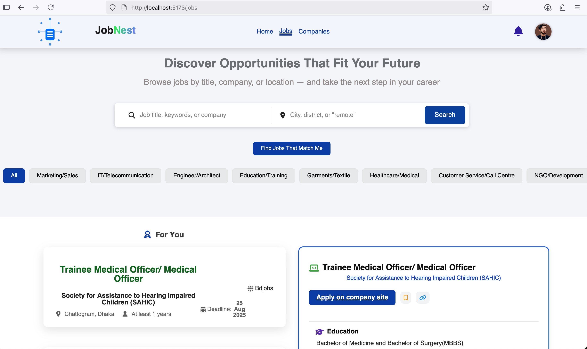
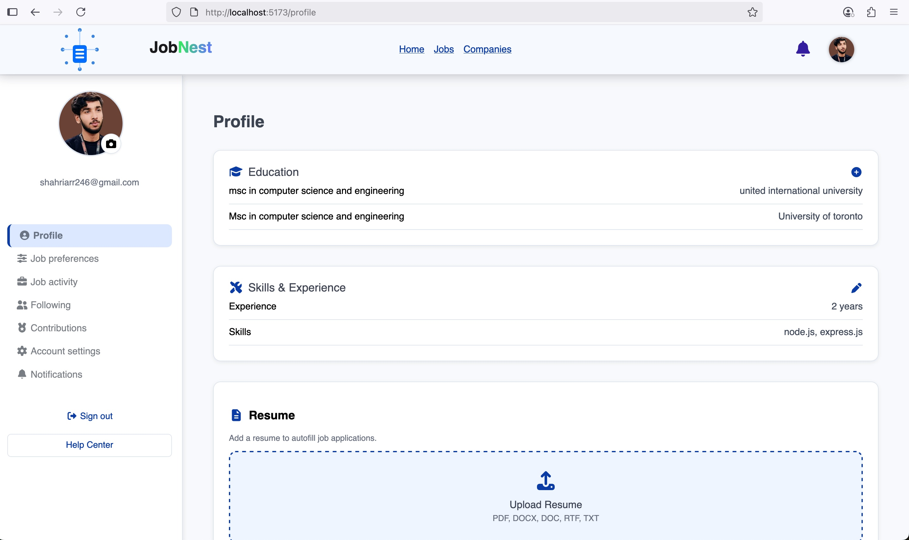

# 🕵️‍♂️ Job Scraping System  

A **full-stack job board application** that scrapes job listings from multiple platforms (e.g., **Glassdoor**, **BdJobs**) using **Puppeteer** and stores them in a **MySQL database**.  
Users can create profiles, upload resumes, manage qualifications, and get **personalized job recommendations** based on their skills, education, and experience.  
Additionally, the system uses a **Large Language Model (Gemini API)** to **organize and structure raw job descriptions**, making them more readable and standardized.  

---

## ✨ Features  

### 🔍 Job Scraping  
- Extracts job listings from **Glassdoor** and **BdJobs**  
- Saves **job title, company, location, experience, education, skills, deadline, published date, and link**  

### 🤖 Job Description Processing (LLM Integration)  
- Uses **Gemini API** (Large Language Model)  
- Cleans, organizes, and standardizes **raw job descriptions**  
- Extracts **key responsibilities, skills, and requirements** automatically  

### 🔐 User Authentication  
- Secure **signup & login** (bcrypt password hashing)  
- Email notifications with **Nodemailer**  

### 👤 Profile Management  
- Upload **profile picture & resume**  
- Add multiple **qualifications** (university, degree, field of study)  
- Add/edit **skills & experience**  

### 📑 Job Search & Filtering  
- Dropdown-based search with **recent searches & suggestions**  
- Job listing with **filters, pagination, and details**  
- **Login required** to view job details  

### 🎯 Recommendations  
- **Personalized job recommendations** based on profile data and search behavior  

---

## 🛠️ Tech Stack  

### ⚙️ Backend  
- 🚀 **Node.js (Express)**  
- 🕷️ **Puppeteer** (Web scraping)  
- 🗄️ **MySQL** (Database)  
- 🔑 **bcrypt** (Password hashing)  
- 📧 **Nodemailer** (Email notifications)  
- 🧠 **Gemini API (LLM)** → for job description processing  

### 💻 Frontend  
- ⚛️ **React.js**  
- 🧭 **React Router**  
- 🎨 **FontAwesome Icons**  
- 🖌️ **Custom CSS** (Minimal, modern UI)  

---

## 🖼️ Screenshots  

### 📌 Jobs Page  
  

### 📌 Profile Page  
  

---

## 🚀 Future Improvements  
- 🌐 Add more job sources (**LinkedIn, Indeed, etc.**)  
- 🧠 **AI-powered job recommendations** (LLM + ML-based ranking)  
- 🔔 **Notifications** for new jobs matching profile  
- 📊 **Analytics dashboard** for job market trends  

---
